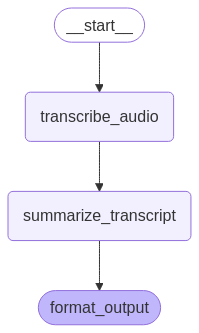

# 🤖 MeetRecap — AI-Powered Meeting Summarizer

**Your meeting assistant that listens so you don't have to take notes.**

---

## 📌 What is MeetRecap?

Have you ever finished a long meeting and thought:
> “Wait, what did we decide again?” or “Who was supposed to do what?”

**MeetRecap** is an AI agent that takes a recorded meeting audio file (`.wav`) and summarizes everything important:
- 👥 **Attendees**
- 💬 **Key Discussion Points**
- ✅ **Action Items**
- 📎 **Decisions Made**

---

## 🚀 Live Demo

Try it out now with one click:

[👉 Launch on Hugging Face Spaces](https://huggingface.co/spaces/nharshavardhana/MeetRecap)

[📎Try with this sample audio meeting](https://drive.google.com/file/d/1p8q3UxIQK-_pzGjSKMnG2CeT4Weiof9Q/view?usp=drive_link)

---

## 🛠 How It Works (in 4 Simple Steps)

1. **Upload** your `.wav` meeting recording.
2. **Click Summarize** – the AI listens using Whisper and generates a transcript.
3. The transcript is **analyzed and summarized** by a language model (like Mistral).
4. You get a clean summary with **attendees**, **key points**, **action items**, and **decisions**.

---

## 💡 Real-World Use Cases

- Busy teams without a designated note-taker – let AI handle the minutes.
- Project managers needing clear summaries of sprint reviews or planning meetings.
- HR or compliance officers who need to review interview panels or training sessions.
- Researchers collaborating across departments who want a recap of collaborative calls.
- Consultants and agencies who need summaries of client calls and workshops.
- Podcasters or content creators summarizing guest interviews.

---

## 🧠 Under the Hood (For Curious Minds)

| Task | Model Used |
|------|------------|
| Transcription | [`Whisper`](https://github.com/openai/whisper) |
| Summarization | [`Mistral-large-latest`](https://mistral.ai) |
| Workflow Orchestration | [`LangGraph`](https://www.langchain.com/langgraph) |
| UI | [`Gradio`](https://gradio.app) |

---

## Agent Workflow


---
## 🌍 Language Support

Currently supports **English** only.  
Multilingual support (e.g., German, Spanish) is on the roadmap. Stay tuned!

---

## 🖼 Example Summary Output

```text
📌 Attendees:
- Alice Johnson
- Bob Smith
- Carol Zhang

💬 Key Points:
- Discussed Q2 product roadmap and new feature rollout.
- Marketing strategy needs more budget allocation.
- Customer feedback loop is underdeveloped.

✅ Action Items:
- Alice to draft revised roadmap by next Monday.
- Bob will reach out to marketing for budget realignment.
- Carol to analyze customer feedback trends.

📎 Decisions:
- Move feature launch to mid-June.
- Allocate 10% more budget to digital marketing.

